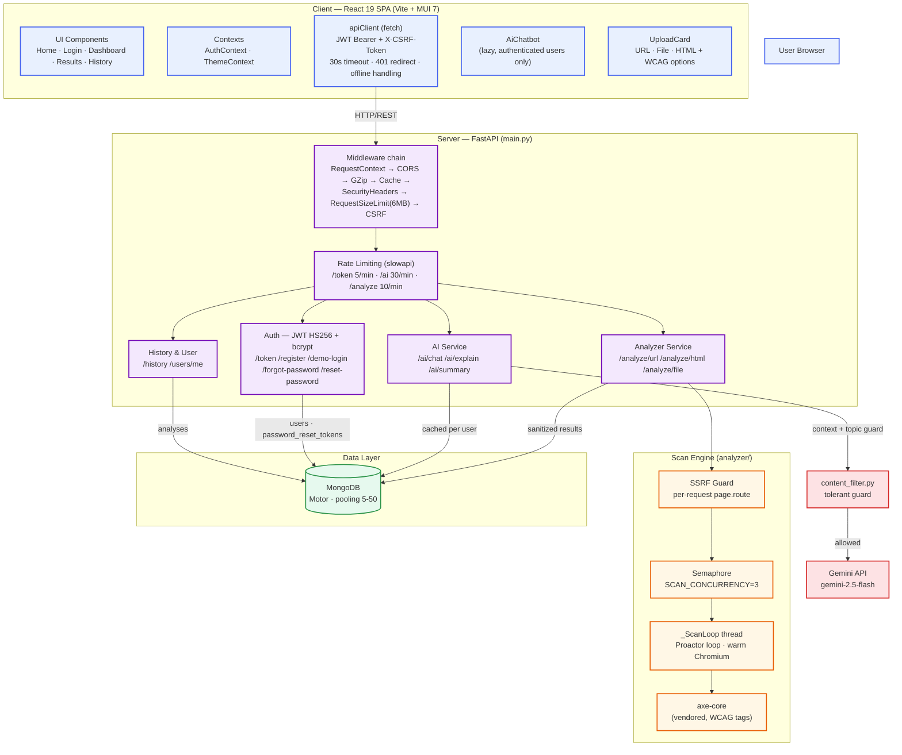
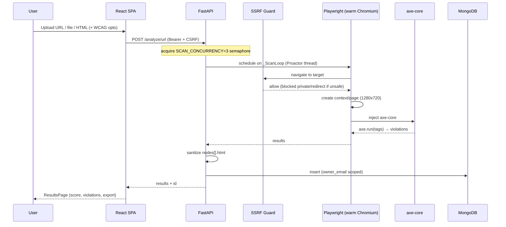
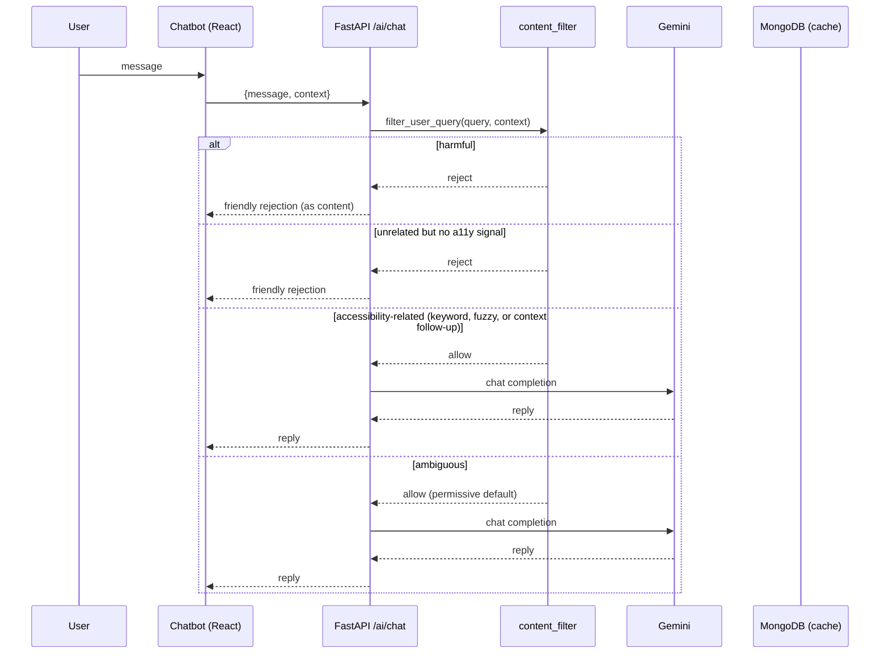

# Architecture Diagram

Current architecture of the Accessibility Analyzer (grounded in the live code, 2026-09-08).

## 1. High-level system

## 2. Scan pipeline (analysis flow)

## 3. AI chat flow (guarded)

## 4. Security & ops notes

- CSRF: signed token via `GET /csrf-token`; checked on every state-changing request except `/token` and `/demo-login` (JWT protects those).
- SSRF: per-request `page.route` guards all page requests, redirects and subresources (DNS-rebinding safe).
- Headers: `nosniff`, `DENY`, `frame-ancestors 'none'`, Permissions-Policy; CSP on index; HSTS behind TLS.
- Deploy: Docker `mcr.microsoft.com/playwright/python:v1.41.1-jammy`, non-root `appuser` (uid 1001); Railway/Render; CI backend job pinned `ubuntu-22.04`.