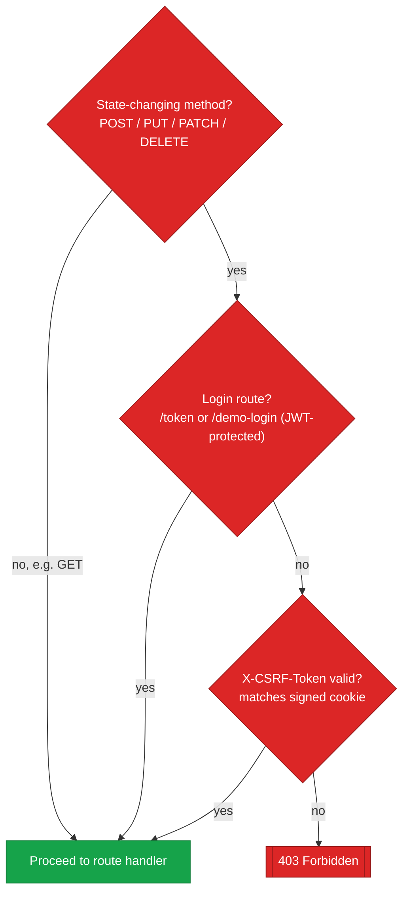

# Accessibility Analysis — Complete Architecture

End-to-end flow from the React SPA through the FastAPI gateway, pre-scan
validation, the browser engine, the axe-core audit, storage, and result
presentation. Color legend: **blue** = frontend, **purple** = backend,
**orange** = browser engine, **green** = data storage, **red** = security
guards / rejection paths. Numbered circles mark the 10 critical decision
points in sequence.

```mermaid
flowchart TB
    classDef frontend fill:#3b82f6,color:#fff,stroke:#1d4ed8,stroke-width:1px
    classDef backend fill:#7c3aed,color:#fff,stroke:#5b21b6,stroke-width:1px
    classDef browser fill:#f97316,color:#fff,stroke:#c2410c,stroke-width:1px
    classDef storage fill:#16a34a,color:#fff,stroke:#15803d,stroke-width:1px
    classDef security fill:#dc2626,color:#fff,stroke:#991b1b,stroke-width:1px

    User(["User with a URL"]) --> Upload["UploadCard<br/>URL / inline-HTML / file upload<br/>+ WCAG version/level selector"]
    Upload --> ApiClient["apiClient (fetch)<br/>JWT Bearer + X-CSRF-Token<br/>30s timeout, 401→login redirect"]
    ApiClient -->|"POST /analyze/url, /html, /file<br/>rate limit 10/min"| MW

    subgraph L2["LAYER 2 — API GATEWAY (FastAPI main.py)"]
        MW["Middleware chain:<br/>RequestContext → CORS → GZip → Cache →<br/>SecurityHeaders → RequestSizeLimit(6MB→413) → CSRF"]
        MW --> RateLimit["slowapi rate limiter<br/>per-endpoint limits"]
        RateLimit --> JWTAuth["JWT dependency<br/>get_current_active_user"]
        CsrfEP["GET /csrf-token<br/>issues the token apiClient sends back"]
    end

    JWTAuth --> V1

    subgraph L3["LAYER 3 — PRE-SCAN VALIDATION (reject → 400)"]
        V1{{"① validate_public_url<br/>http/https only · blocks .local/.internal/<br/>.localhost/.lan/.corp/metadata hosts"}}
        V1 -->|resolve DNS now,<br/>every IP must be globally routable| V1check{"all resolved IPs public?"}
        V1check -->|no| V1Reject[["400 Private/internal URLs<br/>are not allowed"]]
        V1check -->|yes| Orchestrate
    end

    subgraph L4["LAYER 4 — ANALYSIS ORCHESTRATION"]
        Orchestrate["② run_analysis_with_timeout<br/>overall deadline: 90s"]
        Orchestrate -->|timeout| T504[["504 analysis timed out"]]
        Orchestrate -->|scan failed| E502[["502 require_successful_analysis"]]
        Orchestrate -->|ok| ScanLoop
    end

    subgraph L5["LAYER 5 — BROWSER ENGINE (analyzer/)"]
        ScanLoop["③ _ScanLoop background thread<br/>(Windows Proactor) hosting ONE warm<br/>Chromium instance, reused across scans"]
        ScanLoop --> Sem["④ SCAN_CONCURRENCY=3 semaphore<br/>at most 3 page sessions at once,<br/>extra scans queue"]
        Sem --> Context["⑤ fresh isolated browser context per scan<br/>no cookies/localStorage carried over<br/>viewport 1280×720, bypass_csp"]
        Context --> SSRF{{"⑥ SSRFRequestGuard on page.route('**/*')<br/>resolves every hostname at request time —<br/>nav, redirects, iframes, images, fonts, XHR/fetch<br/>(DNS-rebinding safe)"}}
        SSRF -->|non-public destination| SSRFBlock[["Request aborted"]]
        SSRF -->|public / allowed scheme<br/>data,about,blob,javascript| Goto["⑦ page.goto(url, domcontentloaded, 45s)"]
        Goto --> Idle["Best-effort networkidle wait 1.5s<br/>skipped gracefully if page stays busy"]
    end

    subgraph L6["LAYER 6 — THE AUDIT ENGINE"]
        Idle --> Inject["⑧ Inject vendored axe-core 4.8.2<br/>(~525KB, disk read, CDN fallback)<br/>wait for typeof axe !== 'undefined'"]
        Inject --> Run["axe.run(document)<br/>rule tags from wcag2/21/22 (a/aa/aaa)<br/>+ best-practice toggle"]
        Run --> Buckets["Split results:<br/>violations / passes / incomplete / inapplicable<br/>each with impact, WCAG link, nodes[]"]
    end

    subgraph L7["LAYER 7 — OUTPUT HARDENING + STORAGE"]
        Buckets --> Sanitize["⑨ Strip executable markup from every<br/>stored nodes[].html snippet<br/>(stored-XSS defense)"]
        Sanitize --> Mongo[("MongoDB · analyses collection<br/>Motor driver, pool 5–50<br/>owner_email-scoped, returns id")]
    end

    subgraph L8["LAYER 8 — RESULT PRESENTATION + AI"]
        Mongo --> Results["⑩ ResultsPage / History<br/>score = 100 − weighted deductions<br/>(critical −5, serious −2, moderate −1, minor −0.5)"]
        Results --> Export["PDF export<br/>jspdf + html2canvas (screenshot of page)"]
        Results --> Explain["/ai/explain → ai_service<br/>→ Gemini (per-user cached)"]
        Results --> Summary["/ai/summary<br/>local computation, no AI call"]
        Results --> Chat["/ai/chat → content_filter<br/>(topic guard) → Gemini"]
    end

    class Upload,ApiClient,Results,Export frontend
    class MW,RateLimit,JWTAuth,CsrfEP,Orchestrate,Explain,Summary,Chat backend
    class ScanLoop,Sem,Context,Goto,Idle,Inject,Run,Buckets browser
    class Mongo storage
    class V1,V1check,V1Reject,SSRF,SSRFBlock,T504,E502,Sanitize security
```

## Graceful-failure branches

These are early exits off specific nodes above, not a parallel pipeline:

| Trigger | Response |
|---|---|
| Browser launch fails at startup | Degraded, static-only response |
| Analysis fails inside the scan | `502` (`require_successful_analysis`) |
| 90s orchestration deadline hit | `504` analysis timed out |
| Upload body exceeds 6MB | `413` (RequestSizeLimit middleware) |
| Unparseable WCAG options | `400` |
| Non-UTF8 file upload | `400` |
| Private/internal target URL | `400` (`validate_public_url`) |
| Invalid or missing CSRF token | `403` |

## CSRF decision flow (detail on Layer 2)

---
*Generated from the architecture spec — paste the fenced code blocks into
[mermaid.live](https://mermaid.live) or any Mermaid-compatible renderer
(GitHub, Notion, Obsidian, VS Code with the Mermaid extension all render
these natively).*
